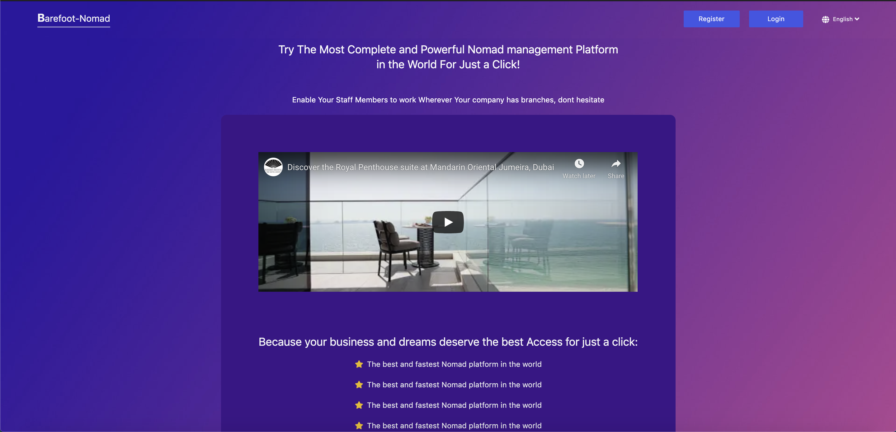

# Barefoot Nomad - Making company travel and accomodation easy and convinient.

    

## Description

Make company global travel and accommodation easy and convenient for the strong workforce of savvy members of staff, by leveraging the modern web.

## hosted version of the application

If you want to have a look on the hosted version of the app click **[HERE](https://pextech.github.io/elite-bn-frontend/)**

## How to get access to the Docker Container/Image

- Go on [Dockerhub](https://hub.docker.com/) website, if you don't have an account, you will be asked to create one

- The image is accessible on this link `https://hub.docker.com/repository/docker/pextech/elite-barefoot`

- To run the image locally run the following command to pull the image  `docker push pextech/elite-barefoot:frontend`

- to start the image run `docker run -it -p 8080:80 --name barefootnginxapp elite-barefoot/frontend`

# Dependencies ⚙︎

- React js
- Node js
- Redux
- Webpack
- Tailwind ss
- Jest
- Babel
- Eslint
- Prettier
- PostCss etc...

# Setting up and running the application 🔧

Clone the repository on your local computer using the command below

> `git clone https://github.com/atlp-rwanda/elite-bn-frontend.git`

Install all project dependencies using the command below

> `npm i`

To start the development server run the command below

> `npm run dev`

To build the application run the command below

> `npm run build`

To start the application in production mode run the command below

> `npm start`

# Authors

team Elite &copy;2021.
